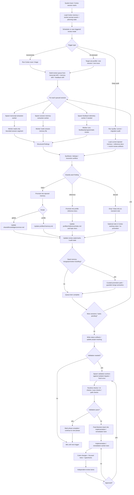
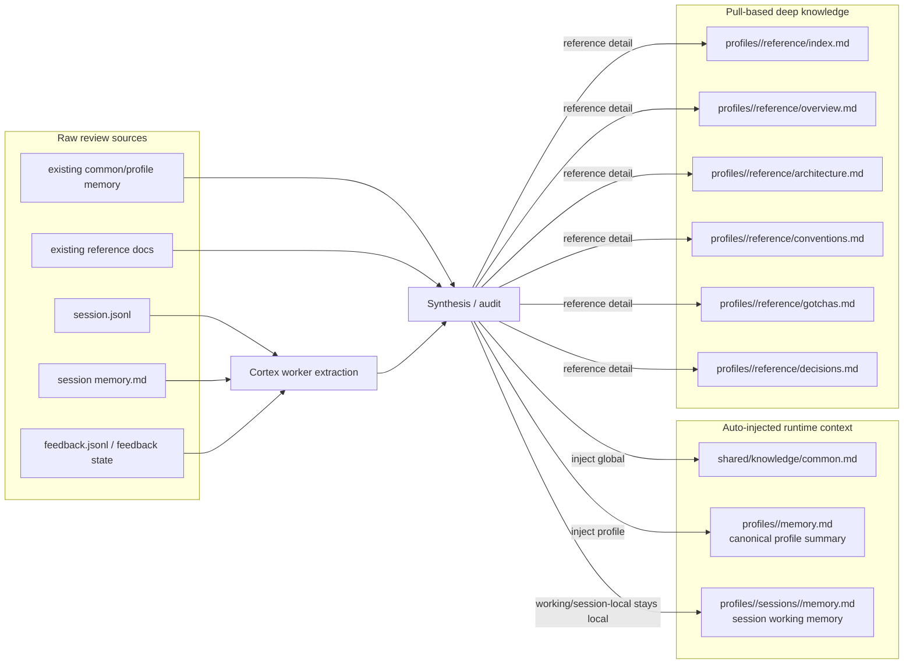
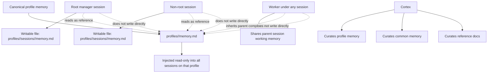
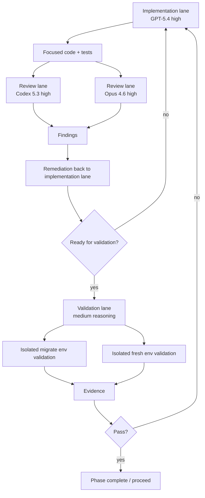

# Cortex Memory v2 — Lifecycle Diagram

## End-to-end lifecycle


```mermaid
flowchart TD
    A[System boot / Cortex session starts] --> B[Load Cortex memory + worker prompt assets + planning state]
    B --> C[Scheduler or user-triggered review mode]

    C --> C1{Trigger type}
    C1 -->|Incremental| D1[Run Cortex scan / triage]
    C1 -->|Deep audit| D2[Run quality / prune / migration audit]
    C1 -->|On-demand| D3[Target one profile / one session / one issue]

    D1 --> E[Build review queue from transcript drift + memory drift + feedback drift]
    D3 --> E
    D2 --> F[Load current injected memory + reference docs + recent review artifacts]

    E --> G{For each queued session}
    G --> H1[Spawn transcript extraction worker]
    G --> H2[Spawn session-memory extraction worker]
    G --> H3[Spawn feedback telemetry worker if needed]

    H1 --> I[Worker reads only bounded session segment]
    H2 --> J[Worker reads session memory file]
    H3 --> K[Worker runs feedback/programmatic review]

    I --> L[Structured findings]
    J --> L
    K --> L

    L --> M[Synthesis / dedupe / reconcile conflicts]
    F --> M

    M --> N{Classify each finding}
    N -->|inject| O[Promote into injected memory]
    N -->|reference| P[Promote into profile reference docs]
    N -->|discard| Q[Drop / keep only as transient note]

    O --> O1{Scope}
    O1 -->|global| R[Update shared/knowledge/common.md]
    O1 -->|profile| S[Update profiles/<profileId>/memory.md]

    P --> T[Update profiles/<profileId>/reference/index.md and topic docs]
    Q --> U[Optional note in Cortex working notes / no promotion]

    R --> V[Update review watermarks / audit state]
    S --> V
    T --> V
    U --> V

    V --> W{Need memory merge/promotion handling?}
    W -->|yes| X[Curated promotion path / guarded merge semantics]
    W -->|no| Y[Queue item complete]
    X --> Y

    Y --> Z{More sessions / tasks pending?}
    Z -->|yes| G
    Z -->|no| AA[Write status artifacts / update project tracking]

    AA --> AB{Validation needed?}
    AB -->|yes| AC[Spawn validation workers against isolated migrate + fresh envs]
    AB -->|no| AD[Idle until next trigger]

    AC --> AE[Runtime checks / UI checks / scan checks / path checks]
    AE --> AF{Validation pass?}
    AF -->|no| AG[Feed blockers back into implementation / remediation lane]
    AF -->|yes| AH[Mark phase complete / continue to next phase]

    AG --> AI[Implementation / remediation worker lane]
    AI --> AJ[Code changes + focused tests + typechecks]
    AJ --> AK[Independent review lanes]
    AK --> AL{Approved?}
    AL -->|no| AI
    AL -->|yes| AC

    AH --> AD
```

## Data movement / ownership model


```mermaid
flowchart LR
    subgraph RuntimeContext[Auto-injected runtime context]
        A1[shared/knowledge/common.md]
        A2[profiles/<profileId>/memory.md\ncanonical profile summary]
        A3[profiles/<profileId>/sessions/<sessionId>/memory.md\nsession working memory]
    end

    subgraph PullBased[Pull-based deep knowledge]
        B1[profiles/<profileId>/reference/index.md]
        B2[profiles/<profileId>/reference/overview.md]
        B3[profiles/<profileId>/reference/architecture.md]
        B4[profiles/<profileId>/reference/conventions.md]
        B5[profiles/<profileId>/reference/gotchas.md]
        B6[profiles/<profileId>/reference/decisions.md]
    end

    subgraph Sources[Raw review sources]
        C1[session.jsonl]
        C2[session memory.md]
        C3[feedback.jsonl / feedback state]
        C4[existing common/profile memory]
        C5[existing reference docs]
    end

    C1 --> D[Cortex worker extraction]
    C2 --> D
    C3 --> D
    C4 --> E[Synthesis / audit]
    C5 --> E
    D --> E

    E -->|inject global| A1
    E -->|inject profile| A2
    E -->|working/session-local stays local| A3
    E -->|reference detail| B1
    E -->|reference detail| B2
    E -->|reference detail| B3
    E -->|reference detail| B4
    E -->|reference detail| B5
    E -->|reference detail| B6
```

## Ownership split after Phase 3


```mermaid
flowchart TD
    A[Root manager session] --> B[Writable file: profiles/<profileId>/sessions/<profileId>/memory.md]
    C[Non-root session] --> D[Writable file: profiles/<profileId>/sessions/<sessionId>/memory.md]
    E[Worker under any session] --> F[Shares parent session working memory]

    G[Canonical profile memory] --> H[profiles/<profileId>/memory.md]
    H --> I[Injected read-only into all sessions on that profile]
    J[Cortex] --> K[Curates profile memory]
    J --> L[Curates common memory]
    J --> M[Curates reference docs]

    A -.reads as reference.-> H
    C -.reads as reference.-> H
    E -.inherits parent composition.-> H

    A -.does not write directly.-> H
    C -.does not write directly.-> H
    E -.does not write directly.-> H
```

## Review / implementation / validation loop


```mermaid
flowchart TD
    A[Implementation lane\nGPT-5.4 high] --> B[Focused code + tests]
    B --> C[Review lane\nCodex 5.3 high]
    B --> D[Review lane\nOpus 4.6 high]
    C --> E[Findings]
    D --> E
    E --> F[Remediation back to implementation lane]
    F --> G{Ready for validation?}
    G -->|no| A
    G -->|yes| H[Validation lane\nmedium reasoning]
    H --> I[Isolated migrate env validation]
    H --> J[Isolated fresh env validation]
    I --> K[Evidence]
    J --> K
    K --> L{Pass?}
    L -->|no| A
    L -->|yes| M[Phase complete / proceed]
```
```